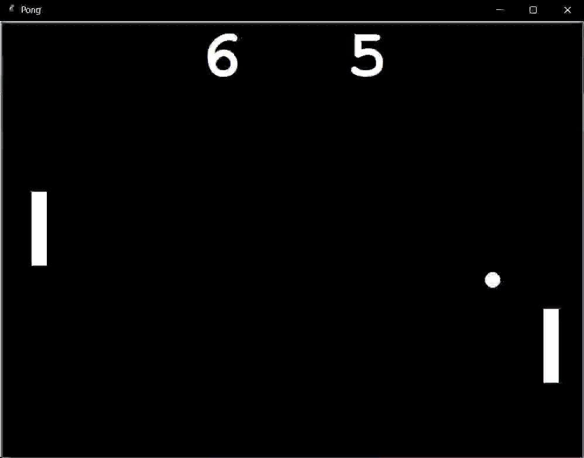

# Pong Game in Python



A classic **Pong game** built in Python using the `turtle` module, featuring **OOP structure**, **smooth two-player controls**, and **sound effects** with `pygame`.

This version includes improvements for a better gameplay experience:
- Smooth, continuous paddle movement for two players
- Paddles cannot move off-screen
- Ball no longer sticks to paddles
- Sound effects for bouncing and scoring
- Live score tracking
- Menu system for selecting game mode and CPU difficulty

---

## Features
- **Single-player mode** with CPU opponent
  - Choose **Easy, Medium, or Hard** difficulty
  - CPU has **human-like behavior** with reaction margin, speed, and occasional hesitation
- **Two-player local multiplayer**
- Smooth and responsive paddle movement
- Ball collision with walls and paddles
- Gradual ball speed increase after paddle hits
- Scoreboard display with live scoring
- Sound effects for paddle bounce and scoring

---

## Controls
- **Right Paddle:** Arrow Up / Arrow Down  
- **Left Paddle:** W / S  
- **Pause Game:** P  
- **Menu Selection:** 1 (1P), 2 (2P), E (Easy), M (Medium), H (Hard)

---

## How to Run
1. Clone the repository:

```bash
git clone https://github.com/legophil101/Pong-Game.git
```
2. Navigate to the project folder:
```bash
cd pong_game
```
3. Install dependencies:
```bash
pip install pygame
```
4. Run the game:
```bash
python main.py
```