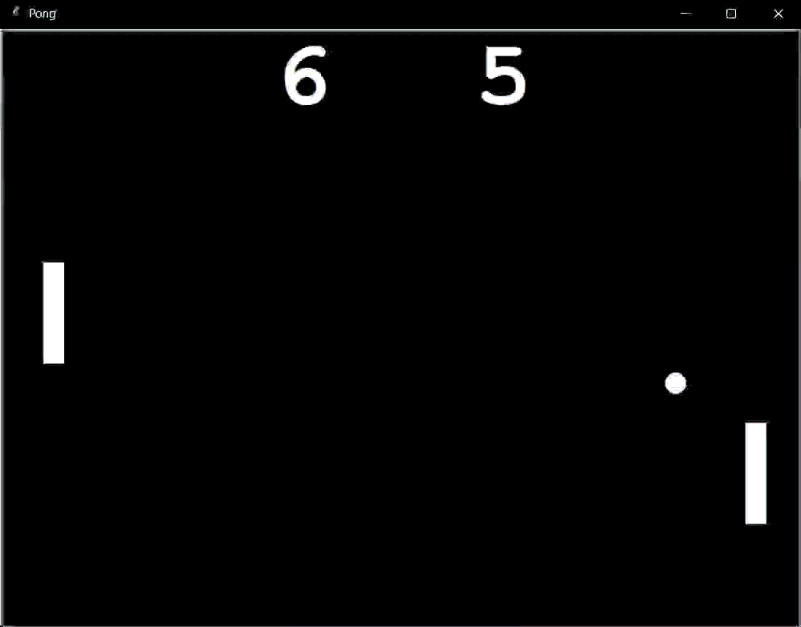

# Pong Game in Python



A classic **Pong game** built entirely from scratch in Python using the `turtle` module, featuring a clean **OOP architecture**, **state-based game flow**, **CPU AI**, and **dynamic sound effects** powered by `pygame`.

This project evolved from a basic Pong clone into a fully featured, polished game with menus, difficulty selection, and replayability in mind.

---

## Features

- **Single-player vs CPU** with three difficulty levels:
  - Easy
  - Medium
  - Hard
- **Two-player mode**
- **Ball physics modes**
  - **Classic Mode** – traditional Pong-style predictable angles
  - **Modern Mode** – angle-based paddle collisions with dynamic, less predictable ball trajectories
- **Customizable match length**
  - First to 3, 5, 7, or 10 points
- **Full menu system**
  - Main Menu
  - Ball Mode Selection
  - Match Length Selection
  - CPU Difficulty Selection
  - Pause Menu
  - Game Over Screen
- **Sound effects & music**
  - All audio assets are organized inside a dedicated `sounds/` directory.
  - Intro music
  - Paddle bounce
  - Wall bounce
  - Scoring sound
  - Win / Lose sounds
- **Pause, resume, restart, and replay support**
- **Smooth paddle movement**
  - Continuous movement with key press + release handling
- **CPU AI**
  - Reaction delay
  - Hesitation
  - Difficulty-based movement speed

---

## Controls

### Player Controls

**Left Paddle (Player 1 / CPU):**
- `W` → Move up
- `S` → Move down

**Right Paddle (Player 1 / Player 2):**
- `↑` → Move up
- `↓` → Move down

---

### Global / Context-Aware Keys

- `Escape` → Pause / Resume
- `B` → Back (menu navigation or resume from pause)
- `R` → Resume from pause
- `T` → Restart match (from pause)
- `N` → Start new match (after game over)
- `M` → Medium CPU difficulty / Return to main menu (context-based)

---

### Menu Selection Keys

- `1` → Player vs CPU
- `2` → Player vs Player
- `C` → Classic Ball Mode
- `M` → Modern Ball Mode
- `E` → Easy CPU
- `H` → Hard CPU
- `3`, `5`, `7`, `0` → Match length (3, 5, 7, or 10 points)

---

## How to Run
1. Clone the repository:
```bash
git clone https://github.com/legophil101/Pong-Game.git
```
2. Navigate to the project folder:
```bash
cd Pong-Game
```
3. Install dependencies:
```bash
pip install pygame
```
4. Run the game:
```bash
python main.py
```